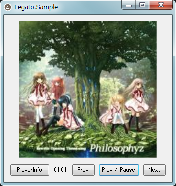

# Legato(en)

AIMP4 Remote API Wrapper Library for .NET

Let's get your track information and your album art from AIMP4!  

**This software is in alpha release now.**  
**Therefore, unimplemented modules and unstable behavior may be done.**

## Legato.Sample

## License(Legato)
MIT license

## License(Legato.Sample)
MIT license

## License(Legato.TwitterSample)
Library in use:

- CoreTweet : MIT License
- Json.NET(Newtonsoft.Json) : MIT License

Others code are MIT license.

----
----

# Legato(ja)

.NET向けAIMP4 Remote APIラッパーライブラリです。

AIMP4からトラック情報やアルバムアートを取得しましょう！

**現在このソフトウェアはアルファリリース中です。**  
**そのため、未実装の機能や不安定な動作をする場合があります。**

## Legato.Sample

## ライセンス(Legato)
MITライセンス

## ライセンス(Legato.Sample)
MITライセンス

## ライセンス(Legato.TwitterSample)
利用されているライブラリとそのライセンス:

- CoreTweet : MITライセンス
- Json.NET(Newtonsoft.Json) : MITライセンス

その他のコードに関しては、MITライセンスです。
